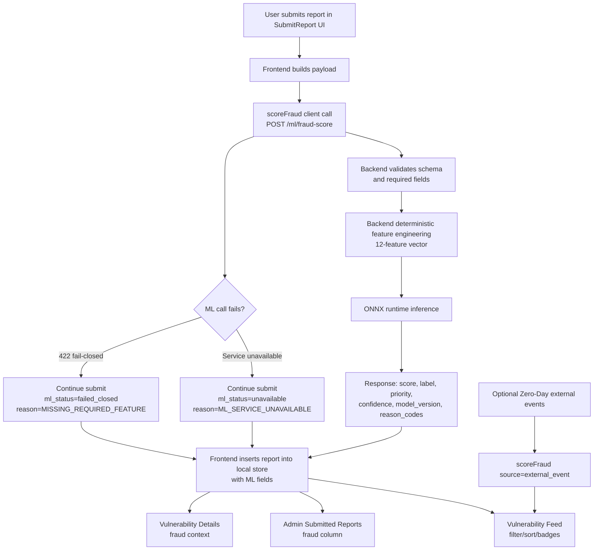

# ML Usage Flow (How The Model Is Used)

This document explains the real implementation flow of the fraud model in this repo: where scoring happens, how data moves, what gets stored, and what users/admins see.

## Mermaid Diagram



## 1. What The Model Decides

- Primary decision: fraud/spam likelihood for a submitted vulnerability report.
- Secondary decision: priority score for admin triage ordering.

Outputs returned by backend scoring API:
- `score` (0 to 1)
- `label` (`low | medium | high`)
- `priority_score` (0 to 1)
- `model_version`
- `features_used`
- `confidence`
- `reason_codes`

Contract source: [docs/ml-model-contract.md](docs/ml-model-contract.md)

## 2. High-Level Architecture

- Frontend app sends report payload to backend ML service before local save.
- Backend service does feature engineering server-side (deterministic, trusted).
- Backend runs ONNX inference and returns score + metadata.
- Frontend stores report plus ML outputs in local report store.
- Dashboard/admin triage views display, filter, and sort by fraud outputs.

Why this design:
- Model logic is not trusted from client side.
- ONNX is served in backend for portability and operational safety.

## 3. Runtime Components

Frontend:
- Submit page: [src/pages/SubmitReport.tsx](src/pages/SubmitReport.tsx)
- ML API client: [src/lib/mlClient.ts](src/lib/mlClient.ts)
- Local report store: [src/lib/reportsStore.ts](src/lib/reportsStore.ts)
- Triage feed UI: [src/components/Dashboard/VulnerabilityFeed.tsx](src/components/Dashboard/VulnerabilityFeed.tsx)
- Admin report table: [src/components/Admin/SubmittedReports.tsx](src/components/Admin/SubmittedReports.tsx)

Backend ML service:
- API endpoints: [ml_service/app/main.py](ml_service/app/main.py)
- Feature engineering: [ml_service/app/feature_engineering.py](ml_service/app/feature_engineering.py)
- ONNX runtime adapter: [ml_service/app/model_runtime.py](ml_service/app/model_runtime.py)
- Schemas: [ml_service/app/schemas.py](ml_service/app/schemas.py)

## 4. Exact Report Submission Flow

### Step A: User submits report
- User fills report fields in submit form.
- Frontend creates payload with title, description, company, website, vulnerability type, affected URLs, risk level, user ID, timestamp.

### Step B: Frontend calls ML scoring API
- `scoreFraud(...)` sends `POST /ml/fraud-score`.
- Base URL is `VITE_ML_SERVICE_URL` (fallback: `http://localhost:8000`).

### Step C: Backend validates and transforms
- Backend validates payload schema.
- Backend computes model feature vector server-side (not from client precomputed features).
- Required field issues return fail-closed style error response (422).

### Step D: Backend runs ONNX inference
- ONNX model loaded from `MODEL_PATH` (default points to `model/fraud_detection_model.onnx`).
- Backend returns score, risk band label, confidence, model version, features used, reason codes, and priority score.

### Step E: Frontend stores report + ML metadata
Stored alongside report:
- `fraud_score`
- `fraud_label`
- `fraud_confidence`
- `fraud_reason_codes`
- `priority_score`
- `ml_model_version`
- `ml_features_used`
- `ml_status`

Storage location:
- Local store in browser localStorage via report store helpers.

## 5. Fallback / Error Behavior

If ML service is unavailable:
- Submission still continues (non-blocking path).
- Report is still saved.
- `ml_status = unavailable`
- `fraud_reason_codes` includes `ML_SERVICE_UNAVAILABLE`
- User gets warning toast, not a hard failure.

If backend returns fail-closed validation (e.g. missing required feature):
- Submission still continues.
- `ml_status = failed_closed`
- Reason code set accordingly.

## 6. Where Scores Are Used In UI

User/admin vulnerability feed:
- Fraud badge shown per report (`high/medium/low` + score).
- Additional states: `Unavailable`, `Failed Closed`, `Not Scored`.
- Sorting by fraud score descending is available.
- Filtering by fraud band is available.

Details panel:
- Fraud score/label shown in vulnerability details.

Admin table:
- Fraud status/score column shown for submitted reports.

Route visibility:
- Dedicated page exists at `/vulnerabilities` for score-centric triage view.

## 7. Optional External Event Scoring Path

For zero-day external stream data:
- Hook scores incoming events after fetch and before state update.
- File: [src/hooks/useZeroDayData.tsx](src/hooks/useZeroDayData.tsx)
- Uses same `scoreFraud` API with `source = external_event`.
- Keeps risk/fraud signal consistent across report submissions and external stream events.

## 8. Service Endpoints

ML service endpoints:
- `GET /ml/health`
- `GET /ml/model-metadata`
- `POST /ml/fraud-score`

Runbook:
- See [ml_service/README.md](ml_service/README.md)

## 9. Data + Security Rules In Practice

- Frontend never computes authoritative model features for serving.
- Backend owns validation and deterministic feature engineering.
- ONNX artifact is serving default.
- PKL is not used by serving path (debug/retraining only policy).
- Model metadata and version are returned for auditability.

## 10. Current Operating Mode

Current implementation is aligned with shadow/assisted workflow:
- Scores are computed and surfaced for triage.
- No hard auto-reject path is enforced by frontend flow.
- Human review remains in control of final report status.

## 11. ML Test Plan (For Demo/Teacher)

Use this checklist to demonstrate that the ML flow is working end-to-end.

### A. Test Setup

1. Start frontend app:
	- `npm run dev`
2. Start ML service:
	- `cd ml_service`
	- `uvicorn app.main:app --host 0.0.0.0 --port 8000 --reload`
3. Ensure frontend points to ML service:
	- `VITE_ML_SERVICE_URL=http://localhost:8000`

### B. API Health Proof

Run and show response from:

1. `GET /ml/health`
	- Expected: `ok: true`, `model_loaded: true`, and correct `model_version`
2. `GET /ml/model-metadata`
	- Expected: `feature_count: 12`, `features_used` list present, thresholds present

### C. Core Scoring Test (Happy Path)

Send one normal request to `POST /ml/fraud-score`.

Example payload:

```json
{
  "title": "Possible SQL injection in login endpoint",
  "description": "Found a payload that bypasses input checks and returns unauthorized records.",
  "company": "Example Corp",
  "website": "https://example.com",
  "vulnerability_type": "SQLi",
  "affected_urls": "https://example.com/login",
  "risk_level": "high",
  "user_id": "demo-id",
  "source": "report_submission"
}
```

Expected proof points:
- `score` is between 0 and 1
- `label` is one of `low | medium | high`
- `model_version` exists
- `features_used` is returned
- `confidence` and `reason_codes` are returned

### D. Fail-Closed Behavior Test

Send a malformed request (for example missing `title` or empty `description`).

Expected:
- Backend returns validation/feature failure (422 or explicit fail response)
- Frontend still allows report submission
- Saved report has:
  - `ml_status = failed_closed` (or `unavailable` if service unreachable)
  - a reason code in `fraud_reason_codes`

### E. Service Unavailable Test

1. Stop ML service.
2. Submit a report from UI.

Expected:
- Submission continues (non-blocking)
- Warning toast appears
- Report saved with:
  - `ml_status = unavailable`
  - reason code `ML_SERVICE_UNAVAILABLE`

### F. UI Triage Proof

In dashboard/admin UI, show:
- Fraud badge visible on report rows
- Sorting by fraud score works
- Filtering by fraud band works
- Special states appear correctly: `Unavailable`, `Failed Closed`, `Not Scored`
- Details view shows fraud score/label context

### G. Optional External Event Test

If using Zero-Day external feed:
- Connect threat API source
- Show events being scored via same ML client path (`source = external_event`)
- Show fraud label/score continuity between report pipeline and external event pipeline

### H. What To Present To Teacher (Evidence Pack)

Capture screenshots of:
1. `/ml/health` response
2. `/ml/model-metadata` response
3. successful score response JSON
4. fail-closed or unavailable behavior
5. dashboard/admin fraud badges + sorting/filtering

Recommended short conclusion:
- "Model is integrated server-side, predictions are versioned, failures are handled safely, and outputs are visible in triage workflows."
